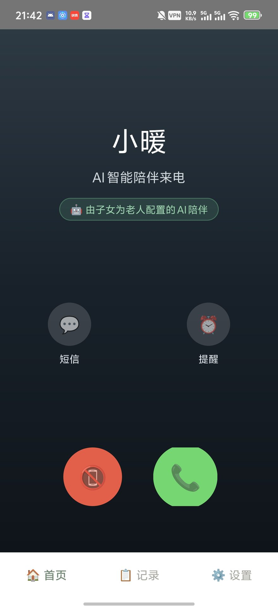
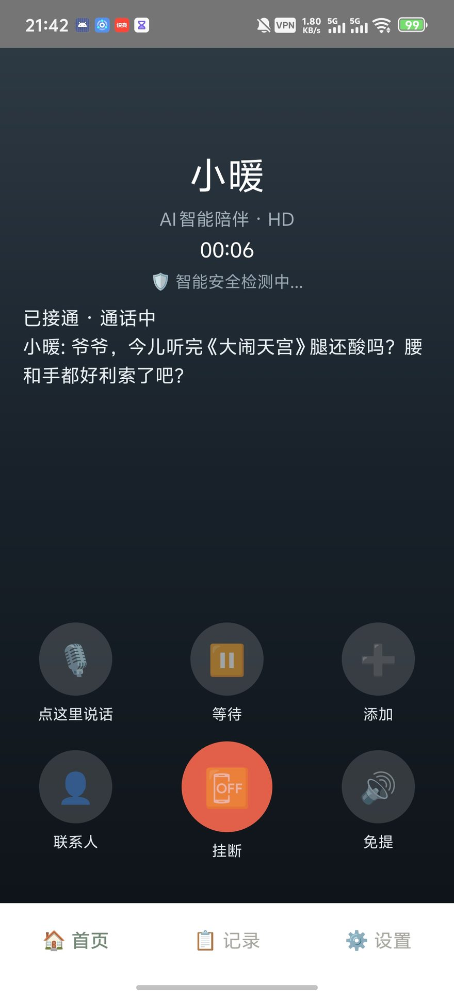
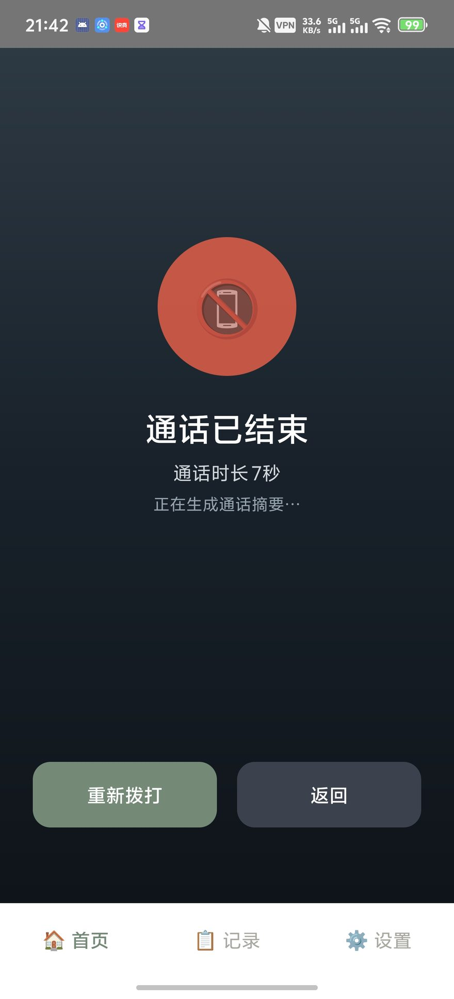
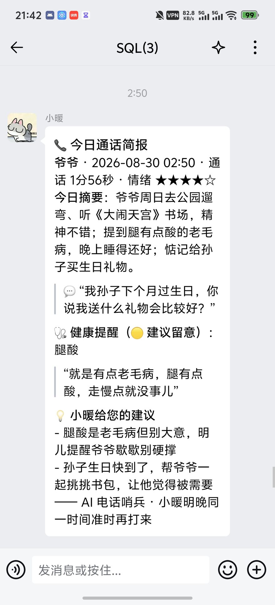
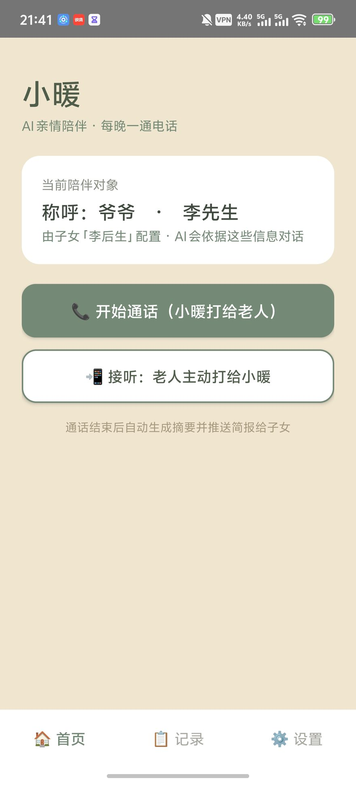
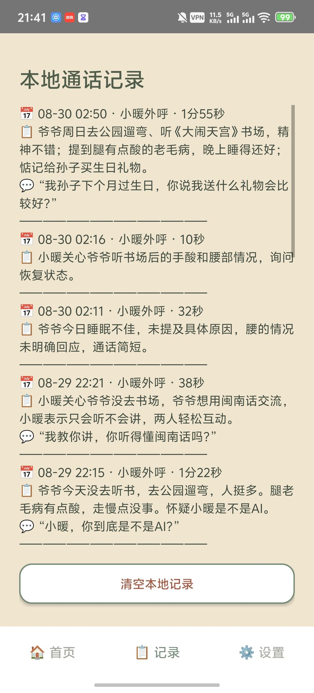
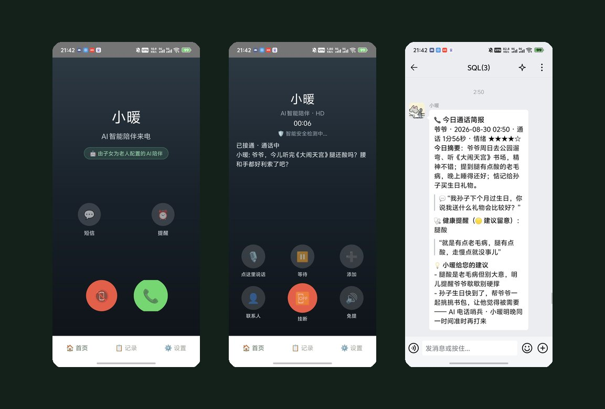

# 小暖 · AI 电话哨兵 (XiaoNuan)

> 每天一通电话，替儿女陪伴爸妈。
> 一个会主动打电话、有记忆、能被老人主动想念的 AI 语音陪伴产品。

**作者：[SXSGAI](https://github.com/SXSGAI)** ｜ License: MIT

---

## 为什么做这个项目

这个项目诞生于 [开物黑客松 · 福州站（2026）](https://github.com/SXSGAI)的 24 小时限时开发。

动机很直接：中国有 **3.1 亿** 60 岁以上老人，其中 **1.8 亿** 是空巢与独居老人，**42%** 常有明显的孤独感。子女在异地，不是不想打——是打过去五分钟就没话说。而老人一天说不上十句话，电视开着只是当背景音。

市面上的方案都有门槛：智能音箱**等人开口**、陪伴机器人**千元级**、适老 App **要学**。我们判断：对这 1.8 亿人来说，唯一零学习成本的交互界面，是**电话**——响铃，接起，说话。

所以在黑客松的 24 小时里，我们没有做 PPT 产品，而是做出了一个**真正在云上运行、真机来电、有记忆**的完整系统。这个仓库就是它的全部源码。

## 它是什么 / 不是什么

✅ 它是：一个**纯软件**的 AI 语音陪伴系统——云端定时主动呼叫老人，带记忆地陪聊，识别健康信号，自动给子女推送简报；老人也可以随时主动打给小暖。

❌ 它不是：一个要老人学会的 App、一个智能音箱技能、一个陪聊聊天框。**电话本身，就是产品界面。**

## 产品预览

| 来电弹出 | 通话中（带记忆开场） | 通话结束页 |
|---|---|---|
|  |  |  |

| 企业微信简报（推给子女） | 首页 | 本地通话记录 |
|---|---|---|
|  |  |  |

<p align="center"></p>

## 真实运行示例：会成长的记忆

> **第 1 通电话**：“我今天腌了腊肉，等小军回来吃”“孙子小宝下个月过生日，想买个书包”
> 系统自动沉淀 → 重要的人（小军、小宝 8 岁）· 生活（腌制腊肉）· 记忆（生日送礼，重要度 4/5）

<p align="center">
 
</p>

> **第 2 通电话开场**：“奶奶，腊肉腌得咋样了？小宝的书包挑好款式没？”
> 就这一句话，老人就知道——有个东西，真的在听我说话。

## 核心功能（全部已实现）

- **每日定时来电**：云服务器到点自动呼叫，手机全屏弹出来电界面（悬浮窗实现，兼容 vivo 等国产 ROM 的后台拦截）
- **拟人化对话**：Kimi K2.5 驱动，短句口语化，一层一层追问，会接话会共情
- **记忆系统**：每通电话自动沉淀"用户画像 + 长期记忆"，下次通话自然引用（"上回说腌腊肉等儿子回来，腌好了没？"）
- **用户画像**：喜好 / 习惯 / 重要的人 / 健康 / 情绪 / 近期生活，六维结构化自动演化
- **人格定制**：子女在 App 设置小暖的性格、语言风格（含方言味）、话题偏好、忌讳话题
- **双向通话**：老人主动打给小暖，获得惊喜应答，绝不尬聊
- **健康守护**：红/黄/蓝三级信号——摔倒/胸闷即时推送子女，腿酸/失眠进周报跟进
- **通话简报**：挂断自动生成摘要 + 金句 + 情绪评分 + AI 给子女的关怀建议，推送企业微信
- **安全边界**：坦诚 AI 身份、绝不编造没发生过的事、绝不提钱不推销（内置反诈铁律）
- **本地记录**：每通电话完整保留在老人手机本地

## 架构

```
老人手机 App（原生 Android，Java）
 ├─ 来电层：悬浮窗全屏来电 + 回铃音（绕过国产 ROM 后台限制）
 ├─ 录音：AudioRecord VOICE_COMMUNICATION（系统级回声消除）+ VAD 自动断句
 └─ HTTP ──▶ 云服务器（Ubuntu 22.04 · FastAPI · systemd 守护）
               ├─ 对话 LLM：Moonshot Kimi K2.5
               ├─ 语音识别：小米 MiMo ASR（mimo-v2.5-asr）
               ├─ 语音合成：小米 MiMo TTS（mimo-v2.5-tts）
               ├─ 记忆引擎：画像卡(JSON) + 记忆表(SQLite)，挂断后 LLM 自动沉淀合并
               ├─ 定时调度：APScheduler（每日定时来电，链式重排）
               └─ 推送：企业微信群机器人（简报/健康提醒/红色警报）
```

## 快速开始

### 0. 准备三样密钥（都有免费/低价额度）

| 用途 | 平台 | 获取 |
|---|---|---|
| 对话 LLM | [Moonshot 开放平台](https://platform.moonshot.cn) | 创建 API Key，模型用 `kimi-k2.5` |
| 语音识别+合成 | [小米 MiMo 开放平台](https://xiaomimimo.com) | 创建 API Key |
| 简报推送（可选） | 企业微信群 → 添加群机器人 | 复制 Webhook 地址 |

### 方式 A：云服务器手动部署（Ubuntu 22.04，推荐）

```bash
# 1. 上传项目（Windows PowerShell）
scp -r ./ root@服务器IP:/opt/xiaonuan

# 2. 登录服务器一键部署（时区/依赖/开机自启全自动）
ssh root@服务器IP
cd /opt/xiaonuan
cp .env.example .env && nano .env        # 填入三样密钥
bash setup_server.sh                      # 自动完成并健康检查
```

⚠️ **云控制台安全组放行 TCP 80（或你改用的端口）**——这是最常见的翻车点。

### 方式 B：AI Agent 自动化部署

如果你使用 ZCode / Claude Code / Cursor 等 AI 编程助手，可以**让 Agent 替你完成整个部署**：

1. 把本仓库克隆到你本地：`git clone https://github.com/SXSGAI/xiaonuan.git`
2. 在项目根目录启动你的 AI Agent
3. 粘贴这句话给 Agent：

```text
请阅读本项目的 AGENT_DEPLOY.md，按照里面的部署清单，
把小暖服务端部署到我的 Ubuntu 服务器上。
服务器信息我会提供；密钥在 .env 中填写，不要打印到日志或提交到 git。
```

Agent 会按 `AGENT_DEPLOY.md` 的清单执行：环境检查 → 安装依赖 → 交互式填写密钥 → systemd 注册 → 时区设置 → 健康检查，并在每一步失败时给出修复建议。

### 方式 C：本地调试（Windows WSL2 / 任意 Linux）

```bash
cd xiaonuan
cp .env.example .env && nano .env     # 填密钥
python3 -m venv venv && ./venv/bin/pip install -r requirements.txt
./venv/bin/uvicorn server:app --host 0.0.0.0 --port 8000
```

浏览器打开 `http://localhost:8000` 即是网页版演示界面。

### Android App 构建

`android-app/` 为原生工程（Java，零第三方依赖），Android Studio 直接打开，或命令行：

```bash
cd android-app
gradle -p . assembleDebug    # 需要 Gradle 8.7+ / AGP 8.5.2 / JDK 17+
# 产物: app/build/outputs/apk/debug/app-debug.apk
```

安装到老人手机 → 设置页填服务器地址 → 授予麦克风/通知/悬浮窗权限 → 完成。

### 服务器地址怎么选

| 场景 | App 里填 |
|---|---|
| 手机和服务器同一局域网 | `http://服务器内网IP:8000` |
| 云服务器（安全组已放行） | `http://服务器公网IP` |
| 本机调试 | `http://127.0.0.1:8000` |

## 配置说明

| 文件 | 作用 |
|---|---|
| `.env` | 密钥与模型配置（从 `.env.example` 复制，**永远不要提交到 git**） |
| `profile.json` | 陪伴对象信息（也可在 App 设置页填写，自动写回） |
| App 设置页 | 称呼/姓名/子女/爱好/健康/忌讳 + 人格定制 + 服务器地址 |

## 当前进展

**✅ 已实现（全部真机验证）**

- 云服务器部署（systemd 守护、崩溃自愈、开机自启）
- 每日定时自动来电 + 悬浮窗全屏来电（拨号音/回铃音/挂断音齐全）
- Kimi K2.5 拟人化对话（思考模式双态切换，实时轮延迟 1.4–3.7s）
- 记忆系统 + 用户画像自动沉淀（挂断后异步，实测二次通话自然引用）
- 人格定制（性格/方言/话题/自定义）+ 关系阶段演进（初次见面→老朋友）
- 双向通话（老人主动来电，惊喜应答不尬聊）
- 健康信号三级识别（红/黄/蓝）+ 企业微信简报（摘要/金句/建议）+ 简报防轰炸
- 防编造（不虚构没发生过的事）+ 姓名硬约束（只从设置读取）
- App：悬浮窗来电、实时对话（VAD 自动断句 + 硬件回声消除）、本地通话记录、人格/对象设置页

**🚧 已知限制（诚实清单）**

- 通话为 App 内全屏来电，暂非 PSTN 运营商真电话（需呼叫中心资质，路线图内）
- 到点提醒依赖设备轮询（30s 粒度），未接厂商推送通道
- 方言识别已支持，方言**合成**待模型能力开放（当前"方言味普通话"兜底）
- 单家庭演示版：多家庭数据隔离（家庭 ID 多租户）约一天工作量待排
- 仅 Android，无 iOS

## 后续方向

沿现有架构继续演进：接入 PSTN 真电话线路、流式对话进一步压缩延迟、厂商推送替代轮询、多方言语音、多家庭数据隔离，以及基于记忆的记忆语义检索（pgvector）。

## 目录结构

```
├── server.py                 # 服务端全部逻辑（FastAPI 单文件）
├── requirements.txt          # 服务端依赖
├── .env.example              # 密钥配置模板（复制为 .env 填写）
├── profile.json              # 陪伴对象配置模板（App 设置自动写回）
├── setup_server.sh           # 云服务器一键部署脚本
├── static/                   # 网页版演示界面 + 音效
├── docs/通话内容策略.md        # 对话策略：人格、记忆、健康铁律、防诈边界
├── AGENT_DEPLOY.md           # AI Agent 自动化部署执行清单
└── android-app/              # 老人端原生 App（Java，零第三方依赖）
    └── app/src/main/...      # MainActivity / GuardService / BootReceiver
```

## 安全与隐私

- 老人侧**完整对话记录只存本机**，不自动上传
- AI 被问及身份时**坦诚承认是 AI**；绝不编造没发生过的事；绝不提钱、不推销、不代操作转账（反诈铁律写入人格层，涉钱话题触发红色告警）
- 密钥只存服务器 `.env`，App 内无任何密钥；请勿将填写了密钥的 `.env` 提交或分享

## License 与商用授权

本项目采用自定义开源许可（基于 MIT 修改，详见 [LICENSE](LICENSE)）：

- **免费使用**：个人学习、研究、教学、学术与非营利公益用途——保留版权声明即可
- **商用需授权**：任何商业用途（销售、SaaS 运营、集成进付费产品、付费部署/定制、收费养老陪伴服务等）须事先获得版权持有者书面授权

**商务合作与商用授权：1989104637@qq.com**（请注明使用场景与规模）

> 图标素材：Icons8 / Google Material Icons（Apache 2.0）
